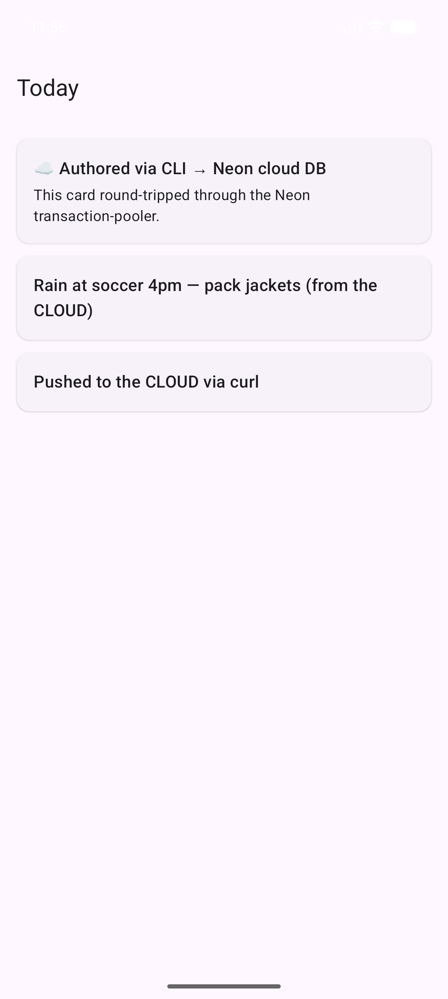

# Dayfold

A calm, AI-powered household dashboard. One account per family — it reads the
family's existing signals (calendar, email, lists, weather, location) and renders
a single sleek daily **briefing** plus smart recommended actions with deep links
("RSVP Thursday [reply]"; "rain at soccer 4pm — pack jackets").

Built mobile-first on **Compose Multiplatform** (Android/iOS/Web). The MVP is a
**content API + CLI + Claude skill**: external AI loops and scheduled tasks
author/update the cards — the dashboard *renders* intelligence produced elsewhere;
it is not an open-ended chatbot. Dogfooded on the operator's own household first.

> **Status (2026-06-28):** M0 prototype is **built + live.** The content API runs on
> Vercel + Neon, the `dayfold` CLI authors content, and the Android app renders it
> on-device. Full flow works end-to-end: Google sign-in → CLI device login → author
> a hub → it renders on the phone. Validation round 1 verdict: **CONDITIONAL —
> learning-lab GO, standalone-business NO-GO.** See
> [`research/validation-round1-2026-06.md`](research/validation-round1-2026-06.md).

---

## Screenshots

| Android feed (Pixel 10) | Cloud feed | DevTools drawer |
|---|---|---|
|  |  |  |

---

## Architecture

```
  operator → CLI / Claude Code ──push──▶
                                         │  HTTPS / JSON
  family   → Mobile app (Android+iOS) ──read+auth──▶
                                         │
                            ┌────────────▼───────────────┐
                            │  API (TypeScript / Hono)    │
                            │  Vercel · stateless         │
                            │  auth · content · invites   │
                            └───┬─────────┬──────────┬───┘
                                ▼         ▼          ▼
                           Postgres   (Object      Firebase
                           (Neon)      storage     Auth
                           families    M1)         (Google /
                           content                  Apple)
                           auth
```

**Key invariants:**
- Every API route checks tenant scope — default-deny, fail-closed.
- Tokens are backend-minted (EdDSA), never trusted for `family_id`/`role` — re-resolved per request.
- Client is offline-first: `network → DB (SQLDelight) → store → UI`. The server is the auth boundary; the local cache is not.
- Content is authored externally (CLI + Claude skill). The app reasons about nothing.

---

## Repository map

| Path | What |
|---|---|
| `apps/api` | Content API — TypeScript / Hono / Postgres (Neon), on Vercel. Auth, hubs+cards, scope+visibility. |
| `apps/client` | Compose Multiplatform core — feed+hub renderer, redux-kotlin store, SQLDelight offline cache. |
| `apps/androidApp` | Android host — the dogfood target (thin app depending on `:client`). |
| `apps/cli` | The `dayfold` CLI (Kotlin) — authors content via the API. |
| `apps/debugdrawer` | Debug drawer library (redux-kotlin devtools, debug/noop/redux variants). |
| `packages/schema` | `content.schema.json` → codegen → Zod (TS) + Kotlin data classes. Single contract. |
| `designs/` | Hi-fi UI/UX mockups (`.dc.html` design files + design briefs). |
| `specs/` | PRD, architecture specs, domain model, prototype plan. |
| `adr/` | Decision records (`decisions-index.md` is the index). Immutable once Accepted. |
| `processes/` | Planning loop, agent routing, dev loop, release runbooks. |
| `context/` | Values & direction (operator-owned), constitution, goals, kill switches. |
| `backlog/` | `now.md` / `next.md` / `later.md` / `operator-inbox.md`. |

---

## CLI quick-start

```bash
# Install (once Homebrew tap is live — ADR 0031):
brew install sloopworks/tap/dayfold

# Authenticate (scan QR in the Dayfold app):
dayfold login

# Author a hub (propose → confirm → push):
dayfold template hub > hub.json
#  edit hub.json: set title, type, status ...
dayfold push college-2026 hub.json --hub

# Author a section inside it:
dayfold template section > sec.json
#  set "hubId": "college-2026", "title": "Dates", "ord": 0
dayfold push dates sec.json --section

# Author a block inside the section:
dayfold template block > blk.json
#  set "sectionId": "dates", "type": "milestone", "body_md": "**Aug 1** — Tuition due"
dayfold push tuition blk.json --block

# Read it back:
dayfold pull --hub college-2026

# Author a briefing card that deep-links into the hub:
dayfold template invite > card.json
dayfold push card-01JXYZ card.json --type invite

# Remove content:
dayfold delete college-2026          # hub (cascades sections+blocks)
dayfold delete card-01JXYZ --card    # card
```

### CLI commands

| Command | Description |
|---|---|
| `dayfold login [--allow-env-key]` | RFC 8628 device grant — approve in the app |
| `dayfold logout` | Revoke session server-side + clear keychain |
| `dayfold whoami` | Show family, API, credential type, resolved scope |
| `dayfold push <id> <file.json> [flags]` | PUT content (card/hub/section/block) |
| `dayfold pull [--hub <id>]` | Read cards+hubs, or one hub tree |
| `dayfold template <type>` | Print starter JSON (card type or hub/section/block) |
| `dayfold delete <id> [--card]` | Remove a hub (default) or a card |
| `dayfold update` | `brew upgrade dayfold` + version check |
| `dayfold version` | Print the CLI version |

---

## Content model

**BriefingCard** — the "Now" feed (`kind` ∈ `action|info|weather|countdown`).
Six typed payloads: `file · link · invite · contact · geo · email`.

**Hub → Section → Block** — standing event/project dossiers. Hub types:
`vacation · starting-college · move · party-event · new-baby · medical · school-year`.
Nine block types: `text · markdown · checklist · link · document · contact · location · milestone · budget`.

Cards deep-link into hubs via `target.{hubId, sectionId?, blockId?}`. Triggers
(`when.at` / `geo`) surface cards at the right time/place.

See [`apps/cli/templates/README.md`](apps/cli/templates/README.md) for the full
authoring reference with worked examples.

---

## API surface (abbreviated)

| Method | Path | Description |
|---|---|---|
| `POST` | `/auth/firebase` | Verify Firebase ID token → mint our EdDSA tokens |
| `POST` | `/auth/refresh` | Rotate refresh token → new access token |
| `POST` | `/auth/signout` | Revoke session |
| `GET` | `/auth/whoami` | Resolved family + scope for the calling credential |
| `GET/PATCH` | `/auth/me` | Profile (display name) |
| `GET` | `/auth/me/export` | Full data export |
| `GET/DELETE` | `/auth/me/credentials` | Connected devices/apps |
| `DELETE` | `/auth/me` | Account soft-delete |
| `POST` | `/families` | Create a family |
| `PUT` | `/families/:fid/cards/:id` | Upsert a briefing card |
| `GET` | `/families/:fid/cards` | List visible cards |
| `DELETE` | `/families/:fid/cards/:id` | Delete a card |
| `PUT` | `/families/:fid/hubs/:id` | Upsert a hub |
| `GET` | `/families/:fid/hubs` | List visible hubs |
| `GET` | `/families/:fid/hubs/:id/tree` | Hub with all sections + blocks |
| `GET` | `/families/:fid/hubs/:id/audience` | Hub visibility + allow-list |
| `PUT` | `/families/:fid/sections/:id` | Upsert a section |
| `PUT` | `/families/:fid/blocks/:id` | Upsert a block |
| `GET` | `/families/:fid/sync` | Keyset sync (cards+hubs+sections+blocks, tombstones) |
| `POST` | `/device/authorize` | Start RFC 8628 device grant |
| `POST` | `/device/token` | Poll for device grant token |
| `GET` | `/device/pending` | Lookup a pending user code (pre-approval) |
| `POST` | `/families/:fid/device/approve` | Owner approves a device |
| `POST` | `/families/:fid/invites` | Mint a family invite |
| `POST` | `/invites:redeem` | Redeem an invite token |
| `GET` | `/families/:fid/invites` | List active invites + pending members |
| `GET` | `/families/:fid/members` | Active member roster |
| `GET` | `/.well-known/jwks.json` | Public JWKS for token verification |

---

## Orientation

- [CLAUDE.md](CLAUDE.md) — session protocol, governance, directory map
- [CHANGELOG.md](CHANGELOG.md) — product/API/feature changes by release
- [context/values-and-direction.md](context/values-and-direction.md) — operator north star
- [context/business-constitution.md](context/business-constitution.md) — what it is NOT
- [adr/decisions-index.md](adr/decisions-index.md) — all decision records
- [research/validation-round1-2026-06.md](research/validation-round1-2026-06.md) — validation verdict
- [planning/workstreams.md](planning/workstreams.md) — live waterfall board
- [backlog/operator-inbox.md](backlog/operator-inbox.md) — items awaiting the operator
- [backlog/now.md](backlog/now.md) — current immediates

## Build & dev

- **Apps:** read [`processes/agent-dev-loop.md`](processes/agent-dev-loop.md) first —
  fixed toolchain (JDK 17, Kotlin 2.3.20, single Gradle root at `apps/`), cheap
  feedback loop (action log + snapshot PNGs + devtools).
- **Deploy spec:** [`specs/prototype/00-build-spec-plan.md`](specs/prototype/00-build-spec-plan.md)
- **Author content:** [`apps/cli/templates/README.md`](apps/cli/templates/README.md)
- **Planning loop:** say **"run a loop iteration"** (follows
  [`processes/planning-loop.md`](processes/planning-loop.md)).
- **Bootstrap:** [`BOOTSTRAP.md`](BOOTSTRAP.md).

## Curator skill (Claude Code)

`.claude/skills/dayfold-curator/` is the authoring wedge — a Claude Code skill
that analyzes your context, runs an onboarding questionnaire, and authors dayfold
Hubs + BriefingCards through the `dayfold` CLI (propose-confirm before every push).

Install globally:

```
sh .claude/skills/dayfold-curator/install.sh
```

Or per-project: copy `.claude/skills/dayfold-curator/` into another repo's
`.claude/skills/`. Requires `dayfold` on PATH and `dayfold login` done first.

## Lineage

Built from the **venture-loop template** (extracted from KeepQR / RevenueCatch).
Process inspiration from the sibling `ambient-ai` spec repo ("render, don't reason";
ADR + open-questions discipline; persona-driven key moments).
